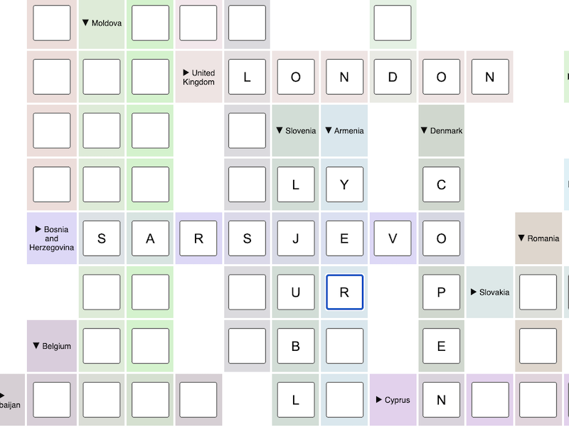

# Cruziwords

Crosswords puzzle generator. The name *cruziwords* is a mix of the Spanish (cruci-) and English terms for crosswords puzzle.

Cruziwords is supposed to be used with just a few dozen input words. It will try to place all of them in a dense
puzzle. Use it, for example, for thematic quizzes, family games …



## Installation

Requires Python 3.9.

We can either choose to build a docker image and run it or use virtualenv.

On docker build an image as:

```shell
docker build -t cruziwords .
```

On virtualenv:

```shell
# Install cruziwords in a virtual environment in development mode
python3.9 -m venv venv
. venv/bin/activate
pip install -e .
```

## Usage

### Input Format

For specifying your own words, this is the format. It's possible to supply multiple possible solutions to the same
clue. The program will try to place all of them.

```
Capital of Germany,BERLIN
European capital,MADRID,PARIS
```

### Web Server

The server expects a csv file to be imported and by submitting it, the server will generate a crossword.

On virtualenv:

```shell
# Start crossword generator webserver:
cruziwords_webserver [PORT]
```

On docker run the built image

```shell
docker run -p 8000:8000/tcp -it --rm --name cruziwords cruziwords
```

… Then visit http://localhost:8000 to upload a file.

### CLI

On virtualenv:

```shell
# Create a crossword puzzle, picking a random example
cruziwords

# Specify your own clues and solutions, and render the puzzle to an HTML file and visualise it on CLI
cruziwords CSV_FILE --html-out HTML_FILE
```

To run it from the built docker image:

```shell
# From one command
docker run -p 8000:8000/tcp -it --rm --name cruziwords cruziwords cruziwords

# Inside the built image as bash
docker run -p 8000:8000/tcp -it --rm --name cruziwords cruziwords /bin/bash
root@xxxxx:/usr/src/app# cruziwords CSV_FILE --html-out HTML_FILE
```

## Development

```shell
pip install tox

# Lint
tox -e black

# Check types
tox -e mypy

# Run tests
tox -e py

# … or all at once!
tox
```

Try playing with the [scoring functions](cruziwords/scoring.py) to see how that affects the shape of the selected
puzzle!